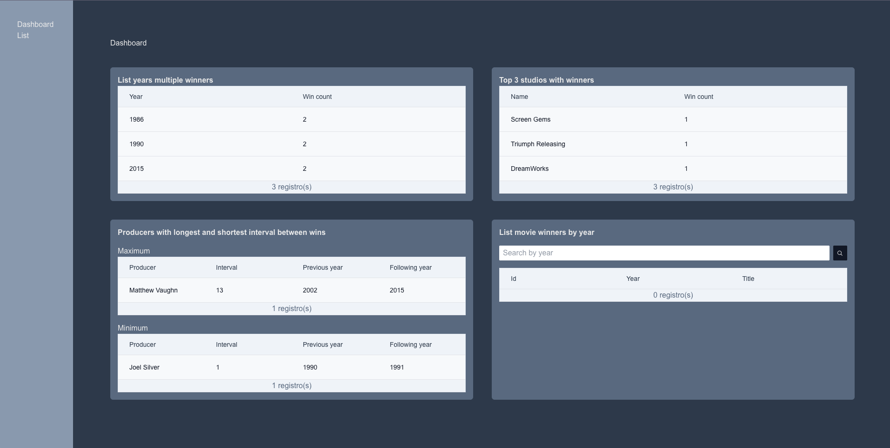
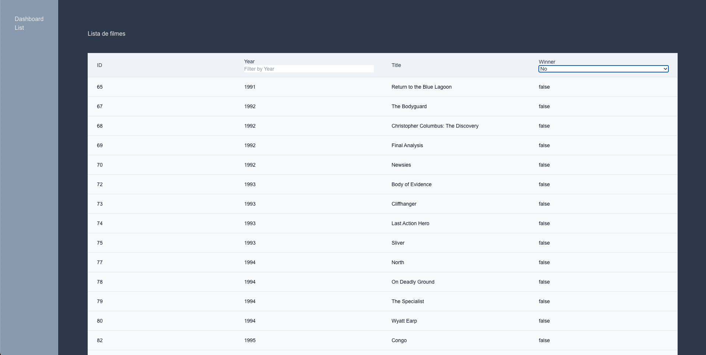

<h3 align="center">
  🚀 Outsera - Movies
</h3>

  <a href="#rocket-sobre-a-API">Sobre o sistema</a>&nbsp;&nbsp;&nbsp;|&nbsp;&nbsp;&nbsp;
  <a href="#open_book-como-utilizar">Como utilizar</a>&nbsp;&nbsp;&nbsp;|&nbsp;&nbsp;&nbsp;
  <a href="#test_tube-testes">Testes</a>&nbsp;&nbsp;&nbsp;|&nbsp;&nbsp;&nbsp;
  <a href="#heart_eyes_cat-demonstração">Demonstração</a>&nbsp;&nbsp;&nbsp;

## :rocket: Sobre o sistema

- O sistema web Outsera - Movies trata-se de uma aplicação que possibilita a leitura da lista de indicados e vencedores da categoria Pior Filme do Golden Raspberry Awards.
- Framework utilizado: **`NextJS`**
- Estilização: **`Tailwind CSS`**
- Testes: **`Vitest`**
- Gerenciamento de estados globais **`Zustand`**
- Ícones: **`Radix UI Icons`**

## :open_book: Como utilizar

- Clone o projeto do github **`git clone https://github.com/ebnersilva/outsera-movies.git`**
- **`cd outsera-movies`**
- Existe um arquivo no projeto denominado **`.nvmrc`** deixe a sua versão do node na mesma versão que esse arquivo demonstra.
- Rode **`yarn`** ou **`npm install`**
- Crie a variável ambiente **`.env`** de acordo com a variável ambiente de exemplo **`.env.example`**
- Inicialize o sistema com o comando **`yarn dev ou npm run dev`**

### :test_tube: Testes

- Para rodar os testes você pode utilizar os scrips do package.json ex: **`yarn test ou npm run test`** e se deseja gerar o coverage de testes rode o comando **`yarn coverage ou npm run coverage`**:

### :heart_eyes_cat: Demonstração

- Tela de dashboard
  

- Tela de listagem
  

---

Feito com 💜 by Ebner Silva :wave:
